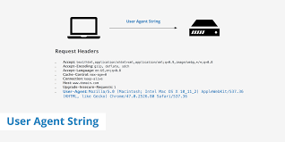

# User-Agent Parsing in a Nutshell

The User-Agent (UA) is an alphanumeric string found in the HTTP headers and helps websites identify the type of device used to access the content. It is a standard part of web architecture and is passed by all web requests in the HTTP headers.

The UA tells the server what kind of device is being used (in addition to other metadata descriptors), which helps the server decide what kind of content to serve and how to serve it. A device detection solution is required to translate the code into useful information about the device's software and hardware. UA strings can be used from anything from simple segmentation and redirection, to more complex content adaptation and device targeting decisions.

There are many different User-Agent codes because they change based on the software and hardware being used. For instance, an iPhone 14 using Brave will have a different User-Agent code than the same phone using Chrome. Every type of device, like phones, tablets, and desktops, has its own code that can be used to identify it. It's also worth noting that bots and crawlers have their own unique codes too.

## User-Agent Parsing
A UA parser can identify and handle requests from certain types of traffic.

Web scraping can use user agents to avoid detection when extracting data from websites. However, relying solely on user agents is not always reliable. A more reliable approach is to use a rotating proxy, which provides multiple IP addresses and avoids the need to define individual IP addresses for each user agent. This helps make your browsing traffic appear as if it's coming from different web browsers, reducing the likelihood of detection and blocking.

Services such as ProxyRack and BestProxyAndVpn provide user agent proxies and allow for the purchase of residential or datacenter proxies. For data scraping tasks, residential proxies are usually preferred.

## Examples of User Agent Strings

**Opera UA String**

`Mozilla/5.0 (X11; Linux x86_64) AppleWebKit/537.36 (KHTML, like Gecko) Chrome/51.0.2704.106 Safari/537.36 OPR/38.0.2220.41`

**Microsoft Edge UA String**

`Mozilla/5.0 (Windows NT 10.0; Win64; x64) AppleWebKit/537.36 (KHTML, like Gecko) Chrome/91.0.4472.124 Safari/537.36 Edg/91.0.864.59`

**Safari UA String**

`Mozilla/5.0 (iPhone; CPU iPhone OS 13_5_1 like Mac OS X) AppleWebKit/605.1.15 (KHTML, like Gecko) Version/13.1.1 Mobile/15E148 Safari/604.1`

See more/documentation: [MDN Web Docs: User-Agent](https://developer.mozilla.org/en-US/docs/Web/HTTP/Headers/User-Agent)